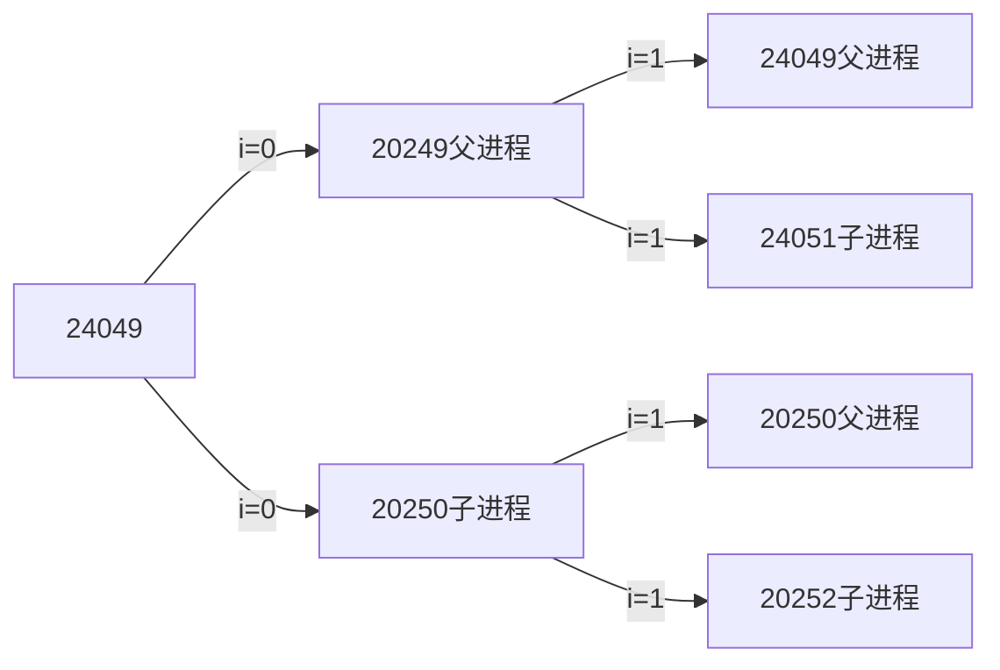

# 系统编程

Linux所见即文件

GDB暂时跳过了

# Day1

目录下文件夹内容

bin：二进制可执行文件

boot：开机启动程序

dev：设备

etc：用户信息和配置文件

lib：库文件

root：管理员宿主目录

usr：unix software resource 用户资源管理目录

Linux文件类型

普通文件：-

目录文件：d

字符设备文件：c

块设备文件：b

软连接：l

管道文件：p

套接字：s

未知文件

more命令

more [OPTION] FILE …

查看文本文件的内容

less命令

less [OPTION] FILE …

查看文本文件的内容

软连接

为保证软连接可以任意搬移，创建时务必对源文件使用绝对路径

硬连接

操作系统给每一个文件赋予唯一的inode，当有相同的inode文件存在时，彼此同步。删除时，只将硬连接计数-1。减为0时，inode被释放。

创建用户：sudo adduser 用户名

修改文件所属用户：sudo chown 新用户名 待修改文件

创建用户组：sudo addgroup 新组名

修改文件所属用户组：sudo chgrp 新用户组名 待修改文件

删除用户：sudo deluser 用户名

删除组：sudo delgroup 用户组名

find命令：找文件

-type 按文件类型搜索

-name 按文件名搜索

-maxdepth 指定搜索深度

-size 按文件大小搜索，单位：k、W、G

-atime（访问时间）、mtime（权限等更改时间）、ctime（内容改动时间）等等

-exec 将find搜索的结果集执行某一指定命令

find /usr/ -name ‘*tmp*’ -exec ls -ld {} \;

-ok 以交互式方式将find搜索的结果集执行某一指定命令

-xargs：将find搜索的结果集执行某一指定命令，当美国集数量过大时，可以分片映射。

find /usr/ -name ‘*tmp*’ | xargs ls -ld

-print0：

find /usr/ -name ‘*tmp*’ -print0 | xargs -print0 ls -ld

grep命令：找文件内容

grep -r ‘copy’ ./ -n

-n参数：:显示行号

ps aux | grep ‘cupsd’  — 检索进程结果集

软件安装：

1. 联网
2. 更新软件资源到本地 sudo apt-get update
3. 安装 sudo apt-get install 软件名
4. 卸载 sudo apt-get remove 软件名
5. 使用软件包 sudo dpkg -i 安装包名

tar压缩：

tar -zcvf  要生成的压缩包名  压缩材料

tar zcvf test.tar.gz file1 dir2 使用gzip方式压缩

tar jcvf test.tar.gz file1 dir2 使用bzip2方式压缩

tar解压：

将压缩命令中的c—>x

rar 压缩

rar a -r 压缩包名（带rar后缀）压缩材料

rar a -r testrar.rar stdio.h test2.mp3

rar 解压

unrar x 压缩包名（带.rar后缀）

zip压缩

zip -r 压缩包名（带.zip后缀） 压缩材料

zip -r testzip.zip dir stdio.h test2.mp3

zip解压

zip -r 压缩包名（带.zip后缀)

unzip testzip.zip

# Day2

vim

跳转到指定行：

88G（命令模式）

:88（末行模式）

跳转到文件首：gg（命令模式）

跳转到文件尾：G（命令模式）

自动格式化程序：

gg=G（命令模式）

大括号对应：

%（命令模式）

光标移至行首：

0（命令模式）执行结束，工作模式不变

光标移至行尾：

$（命令模式）执行结束，工作模式不变

删除单个字符：

x （命令模式）执行结束，工作模式不变

替换单个字符：

将待代替的字符用光标选中，r（命令模式），再按要替换的字符

删除一个单词：

dw（命令模式）光标置于单词的首字母进行操作

删除光标至行尾：

D（命令模式）或者d+$（命令模式）

删除光标至行首：

d0（命令模式）

删除指定区域：

按v（命令模式）切换为“可视模式”，使用hjk1挪移光标来选中待删除区域。

删除指定区1行：

在光标所在行，按dd（命令模式）

删除指定区N行：

在光标所在首行，按Ndd（命令模式）

复制一行：

yy

粘贴

p：向后

P：向前

查找

找 设想内容

命令模式下，按“/”输入要搜索的关键字、回车，使用n检索下一个

找 看到的内容

命令模式下，将光标置于单词任意一个字符上，按”*”/”#”

单行替换

将光标置于待替换行上，进入末行模式，输入:s /原数据/新数据

通篇替换：

末行模式，:%s/原数据/新数据/g     g:不加，只替换每行首个

指定行的替换：

末行模式，:起始行号，终止行号s /原数据/新数据/g g:不加，只替换每行首个

:29,35s /printf/println/g

撤销、反撤销

u、ctrl+r（命令模式）

分屏

sp：横屏分，ctrl+ww切换

vsp：竖屏分，ctrl+ww切换

跳转至man手册

将光标置于待查看函数单词上，使用K（命令模式）跳转。指定卷，nK

查看宏定义

将光标置于待查看宏定义单词上，使用[d查看定义语句

在末行模式执行shell命令

:!命令

:! ls -l

gcc 编译可执行程序

预处理：展开宏、头文件，替换条件编译、删除注释空行空白（gcc -E）

编译：检查语法规范（gcc -S）消耗时间、系统资源最多

汇编：将汇编指令翻译成机器指令（gcc -c）

链接：数据段合并、地址回填（无参数）

hello.c→hello.i→hello.o→a.out

-I 指定头文件目录位置

-c 只进行预处理、编译、汇编，得到二进制文件

-g 编译时添加调试语句，主要支持gdb调试

-Wall 显示所有警告信息

-D 向程序中“动态”注册宏定义

静态库和共享库

静态库：对空间要求较低，对时间要求较高的核心程序中。

动态库：对时间要求较低，对空间要求较高。

静态库制作步骤

1. 将.c生成.o文件
    
    gcc -c add.c -o add.o
    
2. 使用ar工具制作静态库
    
    ar rcs lib库名.a add.o sub.o div.o
    
3. 编译静态库到可执行文件中
    
    gcc test.c lib库名.a -o a.out
    

头文件守卫：防止头文件被重复包含

#ifndef _HEAD_H_

#define _HEAD_H_

…..

#endif

动态库制作及使用

1. 将.c生成.o文件（生成与位置无关的代码 -fPIC）
    
    gcc -c add.c -o add.o -fPIC
    
2. 使用gcc -shared 制作动态库
    
    gcc -shared lib库名.so add.o sub.o div.o
    
3. 编译可执行程序时，指定所使用动态库。 -l：指定库名；-L：指定库路径
    
    gcc test.c -o a.out -lmymath -L./lib
    
4. 运行可执行文件   ./a.out 出错
    
    原因：
    
    链接器：工作于链接阶段，工作时需要-l和-L
    
    动态链接器：工作于程序运行阶段，工作时需要提高动态库所在目录位置
    
    解决方式：
    
    1. 通过环境变量：export LD_LIBRARY_PATH=动态库路径
        
        ./a.out 成功！（临时生效，终端重启环境变量实效）
        
    2. 永久生效：写入终端配置文件。 .bashrc  建议使用绝对路径
        
        vi ~/.bashrc
        
        写入 export LD_LIBRARY_PATH=动态库路径 保存
        
        . .bashrc/  或 source ./bashrc 或 重启终端→让修改后的.bashrc生效
        
        ./a.out 成功
        
    3. 拷贝自定义动态库 到 /lib（标准库所在目录位置）
    4. 配置文件法 
        
        sudo vi /etc/ld.so.conf
        
        写入动态库绝对路径 保存
        
        sudo ldconfig -v 使配置文件生效
        
        ./a.out 成功
        

# Day3

gdb调试工具：大前提，程序是自己写的

基础指令：

-g：使用该参数编译可以执行文件，得到调试表

gdb ./a.out

b: b 20 在20行位置设置断点

run/r：运行程序

n/next：下一条指令（会越过函数）

s/step：下一条指令（会进入函数）

p/print：p i 查看变量的值

continue：继续执行断电后续指令

quit：退出gdb当前调试

Makefile项目管理

命名makefile或者Makefile

1个规则

目标：依赖条件

（一个tab缩进）命令

1. 目标的时间必须晚于依赖条件的时间，否则，更新目录
2. 依赖条件如果不存在，找寻新的规则去产生依赖

ALL：指定makefile的终极目标

2个函数

src = $(wildcard *.c)

找到当前目录下所有后缀为.c的文件，赋值给src

obj = $(patsubst %.c,%.o,%(src))

把src变量里所有后缀为.c的文件替换成.o，将参数3中包含参数1的部分，替换为参数2.

clean：(没有依赖)

-rm -rf $(obj) a.out。“-”作用是，删除不存在文件时，不报错，顺序执行结束。

3个自动变量

$@：在规则的命令中，表示目标

$<：在规则的命令中，表示第一个依赖条件

$^：在规则的命令中，表示所有依赖条件。如果将该变量应用在模式规则中，它可将依赖条件列表中的依赖一次取出，套用模式规则。

模式规则：

%.o:%.c

gcc  -c  $<  -o %@

静态模式规则：

$(obj):%.o:%.c

gcc -c $< -o %@

伪目标：

.PHONY: clean ALL

参数：

-n：模拟执行make、make clean命令

-f：指定文件执行make命令

open/close函数

#include <unistd.h>

int open(const char *pathname, int flags);

参数：

pathname：文件路径

flags：O_RDONY、O_WRONLY、O_RDWR（只读/只写/读写）O_APPEND、O_CREAT、O_EXCL、O_TRUNC、O_NONBLOCK等

使用头文件：<fcntl.h>

返回值：

成功：打开文件所得到的文件描述符（整数）

失败：-1，设置errno

int open(const char *pathname, int flags, mode_t mode);

参数：

pathname：文件路径

flags：O_RDONY、O_WRONLY、O_RDWR（只读/只写/读写）O_APPEND、O_CREAT、O_EXCL、O_TRUNC、O_NONBLOCK等

mode：参数3使用的前提，参数2指定了O_CREAT。取值8进制数，用来描述文件的访问权限。rwx 0664

创建文件最终权限=mode & ~ umask

返回值：

成功：打开文件所得到的文件描述符（整数）

失败：-1，设置errno

open常见错误：

打开文件不存在

以写方式打开只读文件（打开文件没有对应权限）

以只读方式打开目录

int close(int fd);

错误处理函数：与erron相关

printf(”xxx error：%d\n”, errno);

char *strerror(int errnum);

printf(”xxx error：%d\n”, strerror(int errnum));

# Day4

系统中唯一的“读”“写”函数

read函数：

ssize_t read(int fd, void *buf, size_t count)

参数：

fd：文件描述符

buf：存数据的缓冲区

count：缓冲区大小

返回值：

0：读到文件末尾

成功：读到的字节数

失败：-1，设置errno

-1：并且errno=EAGIN或EWOULDBLOCK，说明不是read失败，而是read在以非阻塞方式读设备文件或者网络文件。

 write函数：

ssize_t write(int fd, const void *buf, size_t count)

参数：

fd：文件描述符

buf：存数据的缓冲区

count：数据大小

返回值：

成功：写入的字节数

失败：-1，设置errno

文件描述符：非负整数，指向内核为每一个进程所维护的该进程打开文件的记录表。

PCB进程控制块：本质 结构体

成员：文件描述符表

文件描述符：0/1/2/3/…/1023 （共1024个） 重新打开使用表中可用最小的

0 - STDIN_FILENO

1 - STDOUT_FILENO

2 - STDERR_FILENO

阻塞、非阻塞：是设备文件、网络文件的属性。
阻塞/非阻塞关注的是程序在等待调用结果（消息，返回值）时的状态

阻塞调用：调用结果返回之前，当前线程会被挂起。函数只有在得到结果之后才会返回

非阻塞：指在不能立刻得到结果之前，该函数不会阻塞当前线程，而会立刻返回

产生阻塞的场景。 读设备文件、读网络文件。（读常规文件无阻塞概念）

/dev/tty  —    终端文件

open(”dev/tty”, O_RDWR|**O_NONBLOCK**)  —设置 /dev/tty非阻塞状态（默认为阻塞状态）

fcntl函数：对文件描述符执行操作，操作由CMD确定

不重新打开文件，修改其访问控制属性

int  fcntl(int  fd, int cmd);

int flags = fcntl(fd, f_GETFL);

flags |= O_NONBLOCK;

fcntl(fd, F_SETFL, flgs);

获取文件状态：F_GETFL

设置文件状态：F_SETFL

lseek函数：修改文件偏移量（读写位置）

允许超过文件结尾设置偏移量，文件会因此被拓展

off_t  lseek(int fd, off_t offset, int whence);

参数：

fd：文件描述符

offset：偏移量

whence：起始偏移位置：SEEK_SET/SEEK_CUR/SEEK_END

返回值：

成功：较文件起始位置偏移量

失败：-1 errno

应用场景：

1. 文件的“读”、“写”使用统一偏移位置
2. 使用lseek获取文件大小
3. 使用lseek拓展文件大小，要想使文件大小真正拓展，必须引起IO操作
    
    使用truncate函数，直接拓展文件。
    
    int ret = truncate(”dict.cp”,  250);
    

传入参数：

1. 指针作为函数参数
2. 通常有const 关键字修饰
3. 指针指向有效区域，在函数内部做读操作

传出参数：

1. 指针作为函数参数
2. 在函数调用之前，指针指向的空间可以无意义，但必须有效
3. 在函数内部，做写操作
4. 函数调用结束后，充当函数返回值

传入传出参数：

1. 指针作为函数参数
2. 在函数调用之前，指针指向的空间有实际意义
3. 在函数内部，先做读操作，再做写操作
4. 函数调用结束后，充当函数返回值

stat/lstat函数

int stat(const char *path, struct stat *buf);

将所指的文件状态, 复制到参数buf 所指的结构中。

参数：

path：文件路径

buf：（传出参数）存放文件属性

返回值：

成功：0

失败：-1   errno

获取文件大小：buf.st_size

获取文件类型：buf.st_mode

获取文件权限：buf.st_mode

穿透符号连接：stat会，lstat不会（对于符号链接文件，返回符号链接本身，而不是其指向的文件信息）

link/unlink

 隐式回收

int link(const char *oldpath, const char *newpath);

为已经存在的文件创建一个新的硬连接，功能和ln一样，创建之后inode+1

返回值

成功：0

失败：-1，errno

int unlink(const char *pathname);

从文件系统删除一个名字

特征

清除文件时，如果文件的硬连接数到0，没有dentry对应，但该文件不会马上被释放，要等到所有打开该文件的进程关闭该文件，系统才会挑时间将文件释放

返回值

成功：0

失败：-1，errno

目录操作函数：

DIR * opendir(char *name);

int closedir(DIR *dp);

struct dirent *readdir(DIR * dp);

struct dirent{

inode

char dname[256]

}

# Day5

递归遍历目录

1. 判断命令行参数，获取用户要查询的目录名    argv[1]
    
    argc == 1 —> ./
    
2. 判断用户指定的时候是目录     stat S_ISDIR( );
3. 读目录：
    
    opendir( )
    
    while(readdir( )){
    
    普通文件：直接打印
    
    目录：
    
    拼接目录访问绝对路径
    
    递归调用自己  —> opendir  readir  closedir
    
    }
    
    closedir( )
    

重定向

dup和dup2:

复制一个现存的文件描述符

int dup(int oldfd);

oldfd：已有文件描述符

返回：新文件描述符

int dup2(int oldfd, int newfd);    文件描述符复制，重定向

fcntl函数实现dup：

int fcntl(int fd, int cmd, ……)

cmd: F_DUPFD

参3：被占用的，返回最小可用的

未被占用的，返回≥该值的文件描述符

进程

程序：死的，只占磁盘空间

进程：活的，运行起来的程序，占用内存、cpu等系统资源

PCB进程控制块：

进程id

文件描述符表

进程状态：初始态、就绪态、运行态、挂起态、终止态

进程工作目录位置

*umask掩码

信号相关信息资源

用户id和组id

fork函数

pid_t  fork(void)    （fork把进程当前的情况拷贝一份）

创建子进程，父子进程各自返回，父进程返回子进程pid，子进程返回0

获取当前进程的pid：getpid( )   

获取当前进程父进程pid值：getppid( )

循环创建N个子进程模型，每个子进程表示自己的身份

父子进程相同：

刚fork后，data段、text段、堆、栈、环境变量、全局变量、宿主目录位置、进程工作目录位置、信号处理方式

父子进程不同：

进程id、返回值、各自的父进程、进程创建时间、闹钟、未决信号集

父子进程贡献：

读时共享、写时复制

文件描述符、mmap建立的映射区

代码一：

```c
#include <unistd.h>
#include <stdio.h>
int main(void)
{
	int i=0;
	printf("i son/pa ppid pid  fpid/n");
	//ppid指当前进程的父进程pid
	//pid指当前进程的pid,
	//fpid指fork返回给当前进程的值
	for(i=0;i<2;i++)
	{
 	   pid_t fpid=fork();
  	  if(fpid==0)
 		   printf("%d child  %4d %4d %4d/n",i,getppid(),getpid(),fpid);
   	 else
 		   printf("%d parent %4d %4d %4d/n",i,getppid(),getpid(),fpid);
	}
	return 0;
}
```

运行结果：

```bash
i son/pa ppid  pid   fpid(fork的返回值)
0 parent 21519 24049 24050
0 child  24049 24050     0
1 parent 21519 24049 24051
1 parent 24049 24050 24052
1 child     1  24051     0
1 child     1  24052     0
```

1. 在父进程中，指令执行到for循环中，i=0，接着执行fork，系统中出现两个进程。24010→24049→24950
2. i=1，执行fork，24049和24050都变成了父进程，创建了两个进程，24049→24051，24050→20452



环境变量

字符串，name=value，用来描述环境信息

常用环境变量

PATH  指定可执行文件搜索路径

SHELL 指定当前所使用的命令解析器

TERM  当前终端类型

LANG 指定语言环境

HOME 用户主目录

# Day6

GDB调试

使用gdb调试时，gdb只能跟踪一个进程。可以**在fork函数调用之前**，通过指令设置gdb调试工具跟踪父进程或者是跟踪子进程，默认跟踪父进程

set follow-fork-mode child 命令设置gdb在fork之后跟踪子进程

set follow-fork-mode parent 设置跟踪父进程

exec 函数族

fork创建子程序执行后执行的是和父进程相同的程序（但有可能执行不同的代码分支），子进程往往要调用一种exec函数执行另一个程序。当进程调用一种exec函数时，该进程的用户空间代码和数据完全被新程序替换，从新程序的启动例程开始执行。调用exec并不创建新进程，所以调用exec前后该进程的id并未改变。

将当前进程的.text、.data替换为所要加载程序的.text、.data，然后让进程从新的.text第一条指令开始执行，但进程ID不变

int execl(const char *path, const char *arg,  …);  自己指定待执行程序路径

加载一个进程，通过 路径+程序名 加载

参数1：要加载的程序的名字。该函数需要配合PATH环境变量使用，当PATH中所有目录搜索后没有参数1出错返回。

参数2：argv0

参数3：argv1

…：argvN

哨兵：   NULL

常用于调用系统 程序，如ls、date等 

int execlp(const char *file, const char *arg,  …);  借助PATH环境变量找寻待执行程序

execlp(”ls”, “ls”, “-l”, “-F”, NULL);  使用程序名在PATH中搜索

execl(”/biin/ls”, “ls” , “-l”, “-F”, NULL ); 使用参数1给出等绝对路径搜索

exec函数一旦调用成功即执行新的程序，不返回。只有失败才返回，错误值-1。所以通常我们直接在exec函数调用后直接调用perror( )和exit( )，无需if判断

```c
execlp("ls", "ls",  "-l", "-d", "-h", NULL);
// 下面的代码只有在出错的时候才会执行
perror("exec error");
exit(1);
```

孤儿进程：父进程先于子进程结束，则子进程成为孤儿进程，子进程的父进程变为init进程

僵尸进程：进程终止，父进程尚未回收，子进程残留资源（PCB）存放于内核中，变成僵尸进程。kil对其无效

wait函数：回收子进程退出资源，阻塞回收任意一个

一个进程在终止时回关闭所有文件描述符，释放在用户空间分配的内存，但它的PCB还保留着，内核在其中保存了一些信息：如果是正常终止则保存着退出状态，如果是异常终止则保存着导致该进程终止的信号是哪个。这个进程的父进程可以调用wait或waitpid获取这些信息，然后彻底清除掉这个进程。

pid_t wait(int *status)       

返回值

成功：清理掉的子进程pid；

失败：-1（没有子进程）

父进程调用wait函数可以回收子进程终止信息。有三个功能

1. 阻塞等待子进程退出
2. 回收子进程残留资源
3. 获取子进程结束状态（退出原因）

获取子进程正常终止值：

WIFEXITED(status) → 为真 → 调用WEXITSTATUS(status) → 得到子进程退出值

获取导致子进程异常终止信号：

 WIFSIGNALED(status)→ 为真 → 调用WTERMSIG(status) → 得到导致子进程异常终止的信号编号

waitpid函数：指定某一个进程回收，可以设置非阻塞

pid_t  waitpid(pid_t pid, int *status, int options)

参数

pid：指定回收的子进程pid

>0 ：待回收的子进程pid

-1：任意子进程

  0：同组的子进程

status：（传出）回收进程的状态

options：WNOHANG 指定回收方式为，非阻塞

返回值

>0  表成功回收的子进程pid

0      调用函数时，参3指定了WNOHANG，并且，没有子进程结束

-1    失败。errno

wait、waitpid         一次调用，回收一个子进程。回收多个：while

进程间通信（IPC）：在内核中开辟一块缓冲区，进程1把数据从用户空间拷到内核缓冲区，进程2从内核缓冲区把数据读走。

特征：

管道：简单

信号：开销小

mmap映射：非血缘关系进程间

socket（本地套接字）：稳定

管道

管道是一种最基本的IPC机制，作用于有血缘关系的进程之间，完成数据传递。调用pipe系统函数即可创建一个管道。

实现原理：

内核借助环形队列机制，使用内核缓冲区实现

特质

1. 位文件
2. 管道中的数据只能一次读取
3. 数据在管道中，只能单向流动

局限性：

1. 数据不能进程自己写，自己读
2. 管道中数据不可反复读取。一旦读走，管道中不再存在
3. 采用半双工通信方式，数据只在单方向上流动
4. 只能在有公共祖先的进程间使用管道

pipe函数：  创建，并打开管道

int pipe(int fd[2]);

参数：

fd[0]    读端

fd[1]    写端

返回值：

成功：0

失败：-1 errno

管道读写行为

读管道

1. 管道有数据，read返回实际读到的字节数
2. 管道无数据
    1. 无写端，read返回0（类似读到文件尾）
    2. 有写端，read阻塞等待

写管道

1. 管道读端全部被关闭，进程异常终止
2. 管道读端没有全部关闭
    1. 管道已满，write阻塞
    2. 管道未满，write将数据写入，并返回实际写入的字节数

# Day7